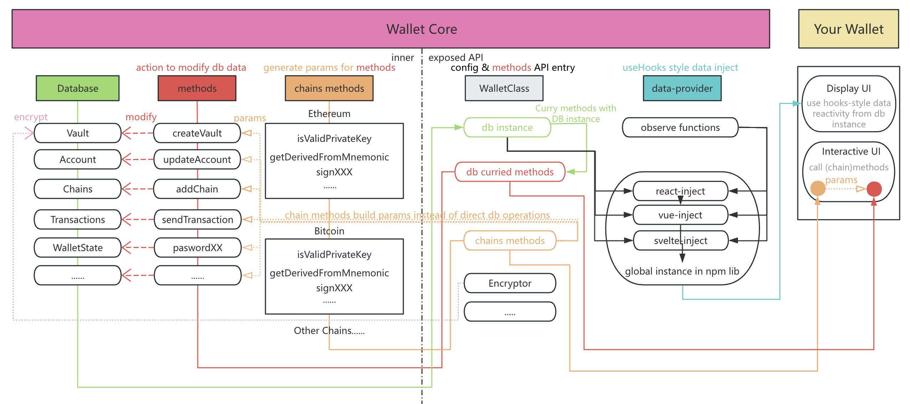

<p align="center" width="400">
  
</p>


# Wallet Core

A cross-chain | cross-platform | cross-ui-framework web3 wallet core library.
Can be used to quickly build your own wallet application.

Checkout the [detail development docs](https://wallet.tether.io/)


## ⭐ Features

💾 **存储层跨端:** 存储层使用 [RxDB](https://rxdb.info/)，可以任选 storge layer，支持 Extension | React Native | Node | Web Memory。

⛓️ **异构多链支持:** 异构链抽象解耦，可以快速接入新的链。

🎨 **支持多种前端框架:** 数据可以注入任意前端框架，当前支持 **React** | **Vue3** | **Svelte**。

🔐 **自定义钱包校验方式:** 提供内置的(登录时写入内存 | 签发时通知式 | 移动端指纹) 校验，也可以自定义校验方式。

💰 **多种资产管理方式:** 支持以中心化的方式拉取账户资产，也支持去中心化方式的自选资产链上查询。

🔑  **多种硬件钱包支持** 支持 ledger / onekey / keystone。


## 🔗 Blockchains

| Blockchain   	|  Supported  
|---	          |---	      
|  Conflux 	    |  ✅ 	     
|  Bitcoin 	    |  ✅ 	     
|  Ethereum  	  |  ✅ 	      
|  TON 	        |  ✅	    
|  Solana 	    |  ✅ 	     
|  Cosmos 	    |  ✅ 	    
|  Others... 	  |  ⌛  	    


### 🏗️ Architecture
<p align="center" width="10" height=10>
  
</p>


##  Example  

Checkout [Quick start guide](./docs/) for more detailed guide.

### **</>**  Example usage of WalletClass settings

```typescript
import { getRxStorageDexie } from 'rxdb/plugins/storage-dexie';
import WalletClass, { Encryptor, InteractivePassword } from '@cfx-kit/wallet-core-wallet';
import methods from '@cfx-kit/wallet-core-methods/allMethods';
import { inject } from '@cfx-kit/wallet-core-react-inject';
import EVMChainMethods, { EVMNetworkType, EthereumSepolia, EthereumMainnet } from '../../../../chains/evm/src';
import SolanaChainMethods, { SolanaNetworkType, SolanaTestnet, SolanaMainnet } from '../../../../chains/solana/src';

const chains = {
  [EVMNetworkType]: EVMChainMethods,
  [SolanaNetworkType]: SolanaChainMethods,
};

export const wallet = new WalletClass<typeof methods, typeof chains>({
  databaseOptions: {
    storage: getRxStorageDexie(),
    encryptor: new Encryptor(interactivePassword.getPassword.bind(interactivePassword)),
  },
  methods,
  chains,
  injectDatabasePromise: [inject],
});

(async () => {
  /** 初始化密码，只需要运行一次 */
  await wallet.methods.initPassword('12345678');
})();

(async () => {
  /** 签发时需要解密私钥，会触发interactivePassword的passwordRequest$ */
  interactivePassword.passwordRequest$.subscribe(async (request) => {
    const password = prompt('Please input password');
    if (password) {
      if (await wallet.methods.validatePassword(password)) {
        request.resolve(password);
      } else {
        request.reject('Incorrect password');
      }
    } else {
      request.reject('User cancel password request ');
    }
  });
})();

(async () => {
  /** 添加内置网络 */
  await wallet.initPromise.then(() => {
    wallet.methods.addChain({ ...EthereumMainnet, type: EVMNetworkType });
    wallet.methods.addChain({ ...SolanaMainnet, type: SolanaNetworkType });
  });
})();
```

### **</>**  Example usage in React
```typescript
import { useVaults, useAccountsOfVault, useCurrentAccount } from '@cfx-kit/wallet-core-react-inject';
import { wallet } from './wallet';


const Apps = () => {
  const vaults = useVaults();

  return (
      <div>
        <button
          onClick={() => 
            wallet.methods.addPrivateKeyVault({
              privateKey: wallet.chains.Solana.getRandomPrivateKey(),
              source: 'create'
            })
          }
        >
          add Random Solana PrivateKey Vault
        </button>

        {vaults?.map((vault, index) => (
          <div key={vault.value} style={{ background: index % 2 === 0 ? 'red' : 'lightblue', height: 'fit-content', marginTop: 20 }}>
            <Vault vault={vault} />
          </div>
        ))}
      </div>
  );
};

const Vault = ({ vault }: { vault: NonNullable<ReturnType<typeof useVaults>>[number] }) => {
  const [inEdit, setInEdit] = useState(false);
  const inputRef = useRef<HTMLInputElement>(null!);

  return (
    <>
      <div>
        {inEdit ? <input ref={inputRef} defaultValue={vault.name} /> : vault.name}
        {vault.type === 'mnemonic' && (
          <button
            style={{ marginLeft: 8 }}
            onClick={() => {
              wallet.methods.addAccountOfMnemonicVault(vault);
            }}
          >
            add account
          </button>
        )}
        <button
          style={{ marginLeft: 8 }}
          onClick={async () => {
            if (inEdit) {
              await wallet.methods.updateVault(vault.id, { name: inputRef.current.value || vault.name });
            }
            setInEdit((pre) => !pre);
          }}
        >
          {inEdit ? 'save' : 'edit'}
        </button>
        <button
          style={{ marginLeft: 8 }}
          onClick={() => {
            wallet.methods.deleteVault(vault);
          }}
        >
          delete vault
        </button>
      </div>
      <Accounts vaultId={vault.id} />
    </>
  );
};


const Accounts = ({ vaultId }: { vaultId: string }) => {
  const accounts = useAccountsOfVault(vaultId);

  return (
    <div>
      {accounts?.map((account, index) => (
        <div key={account.id} style={{ background: index % 2 === 0 ? 'gray' : 'yellow', height: 'fit-content', padding: 8 }}>
          <Account account={account} />
        </div>
      ))}
    </div>
  );
};

```
