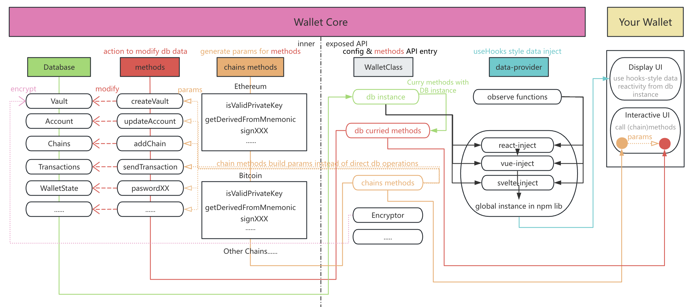

<p align="center" width="400">
  
</p>


# Wallet Core 

A cross-chain | cross-platform | cross-ui-framework web3 wallet core library.
Can be used to quickly build your own wallet application.

Checkout the [detail development docs](https://wallet.tether.io/)
English | [中文](https://github.com/fluent-wallet/wallet-core/blob/docs/README-zh.md)


## ⭐ Features

💾 **Cross-Platform Storage Layer:** Storage layer uses [RxDB](https://rxdb.info/), with flexible storage layer options, supporting Extension | React Native | Node | Web Memory.

⛓️ **Multi-Chain Support:** Abstract decoupling of heterogeneous chains, enabling quick integration of new chains.

🎨 **Multiple Frontend Framework Support:** Data can be injected into any frontend framework, currently supporting **React** | **Vue3** | **Svelte**.

🔐 **Custom Wallet Validation Methods:** Provides built-in validation (memory write during login | notification-based signing | mobile fingerprint), and supports custom validation methods.

💰 **Multiple Asset Management Methods:** Supports both centralized account asset fetching and decentralized self-selected on-chain asset queries.

🔑 **Multiple Hardware Wallet Support:** Supports ledger / onekey / keystone.


## 🔗 Blockchains

| Blockchain   	|  Supported  
|---	          |---	      
|  Conflux 	    |  ✅ 	     
|  Bitcoin 	    |  ✅ 	     
|  Ethereum  	  |  ✅ 	      
|  TON 	        |  ✅	    
|  Solana 	    |  ✅ 	     
|  Cosmos 	    |  ✅ 	    
|  Others... 	  |  ⌛  	    


### 🏗️ Architecture
<p align="center" width="10" height=10>
  
</p>


##  Example  

Checkout [Quick start guide](./docs/) for more detailed guide.

### **</>**  Example usage of WalletClass settings

```typescript
import { getRxStorageDexie } from 'rxdb/plugins/storage-dexie';
import WalletClass, { Encryptor, InteractivePassword } from '@cfx-kit/wallet-core-wallet';
import methods from '@cfx-kit/wallet-core-methods/allMethods';
import { inject } from '@cfx-kit/wallet-core-react-inject';
import EVMChainMethods, { EVMNetworkType, EthereumSepolia, EthereumMainnet } from '../../../../chains/evm/src';
import SolanaChainMethods, { SolanaNetworkType, SolanaTestnet, SolanaMainnet } from '../../../../chains/solana/src';

const chains = {
  [EVMNetworkType]: EVMChainMethods,
  [SolanaNetworkType]: SolanaChainMethods,
};

export const wallet = new WalletClass<typeof methods, typeof chains>({
  databaseOptions: {
    storage: getRxStorageDexie(),
    encryptor: new Encryptor(interactivePassword.getPassword.bind(interactivePassword)),
  },
  methods,
  chains,
  injectDatabasePromise: [inject],
});

(async () => {
  /** Initialize password, only needs to run once */
  await wallet.methods.initPassword('12345678');
})();

(async () => {
  /** Private key decryption is required during signing, which will trigger interactivePassword's passwordRequest$ */
  interactivePassword.passwordRequest$.subscribe(async (request) => {
    const password = prompt('Please input password');
    if (password) {
      if (await wallet.methods.validatePassword(password)) {
        request.resolve(password);
      } else {
        request.reject('Incorrect password');
      }
    } else {
      request.reject('User cancel password request ');
    }
  });
})();

(async () => {
  /** Add built-in networks */
  await wallet.initPromise.then(() => {
    wallet.methods.addChain({ ...EthereumMainnet, type: EVMNetworkType });
    wallet.methods.addChain({ ...SolanaMainnet, type: SolanaNetworkType });
  });
})();
```

### **</>**  Example usage in React
```typescript
import { useVaults, useAccountsOfVault, useCurrentAccount } from '@cfx-kit/wallet-core-react-inject';
import { wallet } from './wallet';


const Apps = () => {
  const vaults = useVaults();

  return (
      <div>
        <button
          onClick={() => 
            wallet.methods.addPrivateKeyVault({
              privateKey: wallet.chains.Solana.getRandomPrivateKey(),
              source: 'create'
            })
          }
        >
          add Random Solana PrivateKey Vault
        </button>

        {vaults?.map((vault, index) => (
          <div key={vault.value} style={{ background: index % 2 === 0 ? 'red' : 'lightblue', height: 'fit-content', marginTop: 20 }}>
            <Vault vault={vault} />
          </div>
        ))}
      </div>
  );
};

const Vault = ({ vault }: { vault: NonNullable<ReturnType<typeof useVaults>>[number] }) => {
  const [inEdit, setInEdit] = useState(false);
  const inputRef = useRef<HTMLInputElement>(null!);

  return (
    <>
      <div>
        {inEdit ? <input ref={inputRef} defaultValue={vault.name} /> : vault.name}
        {vault.type === 'mnemonic' && (
          <button
            style={{ marginLeft: 8 }}
            onClick={() => {
              wallet.methods.addAccountOfMnemonicVault(vault);
            }}
          >
            add account
          </button>
        )}
        <button
          style={{ marginLeft: 8 }}
          onClick={async () => {
            if (inEdit) {
              await wallet.methods.updateVault(vault.id, { name: inputRef.current.value || vault.name });
            }
            setInEdit((pre) => !pre);
          }}
        >
          {inEdit ? 'save' : 'edit'}
        </button>
        <button
          style={{ marginLeft: 8 }}
          onClick={() => {
            wallet.methods.deleteVault(vault);
          }}
        >
          delete vault
        </button>
      </div>
      <Accounts vaultId={vault.id} />
    </>
  );
};


const Accounts = ({ vaultId }: { vaultId: string }) => {
  const accounts = useAccountsOfVault(vaultId);

  return (
    <div>
      {accounts?.map((account, index) => (
        <div key={account.id} style={{ background: index % 2 === 0 ? 'gray' : 'yellow', height: 'fit-content', padding: 8 }}>
          <Account account={account} />
        </div>
      ))}
    </div>
  );
};

