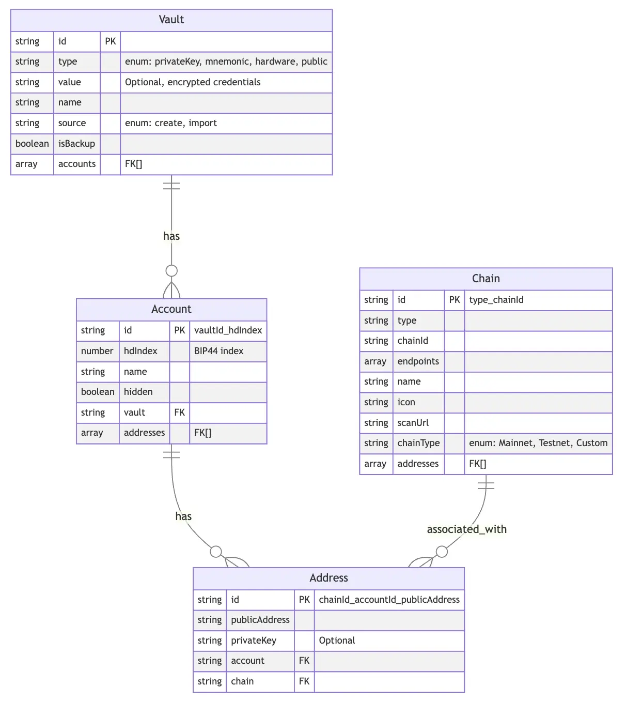

# database

::: tip NOTE
database 对应源码位于 `core/database` 目录下，对应的 npm包 为 `@cfx-kit/wallet-core-database`。
你不会直接使用到这个 npm包，这个包是 `@cfx-kit/wallet-core-wallet` 的前置依赖，开发过程中你只需要使用 [WalletClass instance](./wallet-class.md) 即可。
:::


database 中，每一类 Model 对应的 **typescript类型** 都叫 `'XXX'DocType`，比如 `VaultDocType`、`AccountDocType`...

本篇中提到的 **枚举值** 、各 Model 的类型、以及 **数据库本身的类型** `Database` 和 **WalletState 的类型** `State` 会在 `@cfx-kit/wallet-core-database` 和 `@cfx-kit/wallet-core-wallet` 中同时导出。

一些无关紧要的tips:
  + 各 Model 的 id 要么是随机生成的，要么是自动组合型的，不需要关注。
  + 标记为 `isFinal` 的属性是不可修改的，但是只是在 [methods](./methods-api.md) 层面排除了写入，在RxDB层面并没有限制。


<br/>
<br/>


# 账户体系

账户体系从上至下分为 `Vault`、`Account`、`Address` 三个层级。

ER图如下：

  

## Vault

Vault 是帐户层级的最高单位，是存储区块链账户唯一凭证(助记词/私钥)的保险箱。(`hardware` 和 `public` 类型的 vault 不存储任何数据)

### 数据模型

| Key      | Type    | Required & isFinal | Description                                                  |
|----------|---------|----------|--------------------------------------------------------------|
| id       | string  | 是 & 是       | 随机自生成的主键                                             |
| type     | string  | 是 & 是       | **Vault** 的类型，枚举值： `privateKey`、`mnemonic`、`hardware`、`public` |
| value    | string  | 否 & 是       | `privateKey` 和 `mnemonic` 类型的 vault 会存储凭证在这里， 可配合 `encryptor` 加密解密 |
| name     | string  | 是 & 否       | **Vault** 的名称                                                |
| source   | string  | 是 & 是       | **Vault** 的来源，枚举值：`create`或 `import`                 |
| isBackup | boolean | 是 & 否       | 标识 `mnemonic`类型 并且 source 为 `create` 的账户是否已完成备份流程 |
| accounts | array   | 否 & 否       | 下属的 **Account** 的主键集合                               |

### 导出的枚举值

```typescript
export enum VaultTypeEnum {
  privateKey = 'privateKey',
  mnemonic = 'mnemonic',
  hardware = 'hardware',
  public = 'public',
}

export type VaultType = keyof typeof VaultTypeEnum;

export enum VaultSourceEnum {
  create = 'create',
  import = 'import',
}

export type VaultSource = keyof typeof VaultSourceEnum;
```

## Account

Account 是 Vault 的子级， 主要用于标识 `mnemonic` 类型的 **Vault**，在 [BIP44](https://github.com/bitcoin/bips/blob/master/bip-0044.mediawiki) 标准下子账户的 **'address_index'** 索引。

`mnemonic` 和 `hardware` 类型的 vault 可以拥有一个或多个 Account，`hdIndex`属性 即代表 **'address_index'** 索引。

`hardware` 和 `public` 类型的 vault 有且只有一个 Account，`hdIndex` 属性固定为 0 且没有实际意义。

### 数据模型

| Key       | Type    | Required & isFinal | Description                                          |
|-----------|---------|----------|------------------------------------------------------|
| id        | string  | 是 & 是       | 由 `vaultId` 和 `hdIndex` 自动组合生成的主键       |
| hdIndex   | number  | 是 & 是       | [BIP44](https://github.com/bitcoin/bips/blob/master/bip-0044.mediawiki) 中的索引号，用于确定生成的公钥和私钥位置。 |
| name      | string  | 是 & 否       | **Account** 的名称。                                     |
| hidden    | boolean | 否 & 否       | 是否隐藏。                                           |
| vault     | string  | 是 & 是       | 外键，归属的 **Vault** 的主键                         |
| addresses | array   | 否 & 否       | 下属的 **Account** 的主键集合                       |

## Address

**Account** 在 每个 **Chain** 下都会拥有一个对应的 **Address**。

相同 `type` 的 **Chain**(如 'Etherum Mainnet' 和 'Etherum Testnet') 对应的同一个 **Account** 下的 **Address** 的 `publicAddress` 和 `privateKey` 是一样的。

但是它们是不同的 **Address** 实例，因为它们各自的资产和交易记录是独立的。

### 数据模型

| Key           | Type   | Required & isFinal | Description      |
|---------------|--------|----------|------------------|
| id            | string | 是 & 是       | 由 `chainID` 、`accountId` 和 `publicAddress` 自动组合生成的主键 |
| publicAddress | string | 是 & 是       | 公钥地址         |
| privateKey    | string | 否 & 是       | 私钥地址，只有 `mnemonic` 类型的 **Vault** 有，会在创建 **Address** 时存一份而不是每次临时生成 以提高性能表现 |
| account       | string | 是 & 是       | 外键，归属的 **Account** 的主键 |
| chain         | string | 是 & 是       | 外键，归属的 **Chain** 的主键   |


<br />
<br />

## Chain

相同 `type` 的 **Chain** 一般意味着一致的私钥派生算法、密钥派生路径 以及 公钥生成算法。

举个例子，**Ethereum Mainnet**、 **Ethereum Sepolia** 和 **Binance Smart Chain** 的 `type` 都是 **'Ethereum'**;

再举个例子，**Cosmos联盟的链** 的拥有一致的私钥派生算法和路径，仅仅公钥地址有细微不同。
你可以选择将它们设为相同的 `type`，这样可以以 `type` 为单位聚类显示地址。
也可以视为不同的 `type`(**Okex Wallet** 就是这种做法)，**Cosmos联盟中不同的链** 的地址就是分散显示的了。

### 数据模型

| Key       | Type   | Required & isFinal | Description                                    |
| --------- | ------ | -------- | ---------------------------------------------- |
| id        | string | 是 & 是     | 由 `type` 和 `chainId` 自动组合生成的主键          |
| type      | string | 是 & 是     | **Chain** 的类型                                |
|**chainId**| string | 是 & 否     | 链ID，用以区分相同 `type` 的不同链，在 **EVM链** 中是 chainId， 在 **Solana** 等链中是 `endpoints[0]`。(自己自定义) |
| endpoints | array  | 是 & 否     | RPC节点集合，`endpoints[0]` 是使用中的节点       |
| name      | string | 是 & 否     | **Chain** 的名称                                |
| icon      | string | 是 & 否     | **Chain** 的图标                             |
| scanUrl   | string | 是 & 否     | **Chain** 的区块链浏览器 URL                         |
| chainType | string | 是 & 否     | **Chain** 的属性类型, 枚举值: **'Mainnet'**、 **'Testnet'**  和 **'Custom'** |
| addresses | array  | 否 & 否     | 下属的 **Address** 的主键集合                           |

### 导出的枚举值

```typescript
export enum ChainType {
  Mainnet = 'Mainnet',
  Testnet = 'Testnet',
  Custom = 'Custom',
}
```

<br />
<br />

## WalletState

WalletState 是 WalletCore 中一些钱包状态数据的持久化JSON集合，依托于 [RXState](https://rxdb.info/rx-state.html) 实现。并不是数据库的一部分。

如 当前账户、当前链 等内容，并不是 钱包里必须有的概念。如果你做的钱包不是 MetaMask 这类 当前网络&当前链 模式的钱包，可以无视相关数据&方法。

### 数据

| Key                   | Type   | Description                                    |
|-----------------------|--------|------------------------------------------------|
| currentAccountId      | string | 当前账户的 id                                   |
| currentChain'sId      | string | 当前链的 id                                     |
