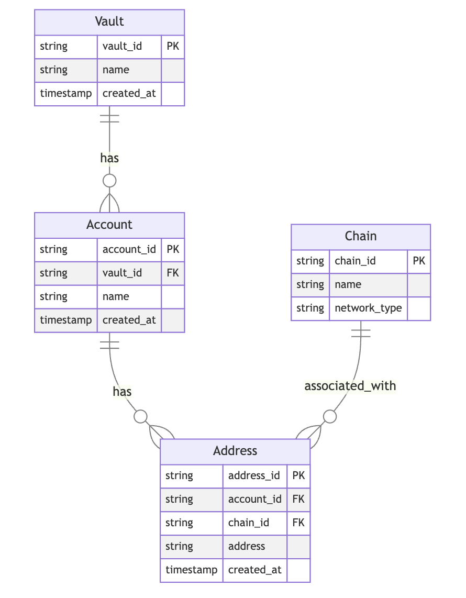

# 账户体系

账户体系从上至下分为 `Vault`、`Account`、`Address` 三个层级。ER图如下：

  

## Vault

Vault 是帐户层级的最高单位，是存储区块链账户唯一凭证(助记词/私钥)的保险箱。(`hardware` 和 `public` 类型的 vault 不存储任何数据)

### 数据模型

| Key      | Type    | Required | Description                                                  |
|----------|---------|----------|--------------------------------------------------------------|
| id       | string  | 是       | 随机自生成的主键                                             |
| type     | string  | 是       | **Vault** 的类型，枚举值： `privateKey`、`mnemonic`、`hardware`、`public` |
| value    | string  | 否       | `privateKey` 和 `mnemonic` 类型的 vault 会存储凭证在这里， 可配合 `encryptor` 加密解密 |
| name     | string  | 是       | **Vault** 的名称                                                |
| source   | string  | 是       | **Vault** 的来源，枚举值：`create`或 `import`                 |
| isBackup | boolean | 是       | 标识 `mnemonic`类型 并且 source 为 `create` 的账户是否已完成备份流程 |
| accounts | array   | 否       | 下属的 **Account** 的主键集合                               |

## Account

Account 是 Vault 的子级， 主要用于标识 `mnemonic` 类型的 **Vault**，在 [BIP44](https://github.com/bitcoin/bips/blob/master/bip-0044.mediawiki) 标准下子账户的 **'address_index'** 索引。

`hardware` 和 `hardware` 类型的 vault 可以拥有一个或多个 Account，`hdIndex`属性 即代表 **'address_index'** 索引。

`hardware` 和 `public` 类型的 vault 有且只有一个 Account，`hdIndex` 属性固定为 0 且没有实际意义。

### 数据模型

| Key       | Type    | Required | Description                                          |
|-----------|---------|----------|------------------------------------------------------|
| id        | string  | 是       | 由 `vaultId` 和 `hdIndex` 自动组合生成的主键       |
| hdIndex   | number  | 是       | [BIP44](https://github.com/bitcoin/bips/blob/master/bip-0044.mediawiki) 中的索引号，用于确定生成的公钥和私钥位置。 |
| name      | string  | 是       | **Account** 的名称。                                     |
| hidden    | boolean | 否       | 是否隐藏。                                           |
| vault     | string  | 是       | 外键，归属的 **Vault** 的主键                         |
| addresses | array   | 否       | 下属的 **Account** 的主键集合                       |

## Address

**Account** 在 每个 **Chain** 下都会拥有一个对应的 **Address**。

相同 `type` 的 **Chain**(如 'Etherum Mainnet' 和 'Etherum Testnet') 对应的同一个 **Account** 下的 **Address** 的 `publicAddress` 和 `privateKey` 是一样的。

但是它们是不同的 **Address** 实例，因为它们各自的资产和交易记录是独立的。

### 数据模型

| Key           | Type   | Required | Description      |
|---------------|--------|----------|------------------|
| id            | string | 是       | 由 `chainID` 、`accountId` 和 `publicAddress` 自动组合生成的主键 |
| publicAddress | string | 是       | 公钥地址         |
| privateKey    | string | 否       | 私钥地址，只有 `mnemonic` 类型的 **Vault** 有，会在创建 **Address** 时存一份而不是每次临时生成 以提高性能表现 |
| account       | string | 是       | 外键，归属的 **Account** 的主键 |
| chain         | string | 是       | 外键，归属的 **Chain** 的主键   |

 
 

## Chain

相同 `type` 的 **Chain** 一般意味着一致的私派生算法、公钥生成算法以及派生路径。

举个例子，**Ethereum Mainnet**、 **Ethereum Sepolia** 和 **Binance Smart Chain** 的 `type` 都是 **'Ethereum'**;

再举个例子，**Cosmos联盟的链** 的拥有一致的私钥派生算法和路径，仅仅公钥地址有细微不同。
你可以选择将它们设为相同的 `type`，这样可以以 `type` 为单位聚类显示地址。
也可以视为不同的 `type`(**Okex Wallet** 就采取了这种做法)，**Cosmos联盟中不同链** 的地址就是分散显示的了。

## Data Model

| Key       | Type   | Required | Description                                    |
| --------- | ------ | -------- | ---------------------------------------------- |
| id        | string | 是     | 由 `type` 和 `chainId` 自动组合生成的主键          |
| name      | string | 是     | **Chain** 的名称                                |
| type      | string | 是     | **Chain** 的类型                                |
| chainId   | string | 否     | **Chain** 的链 ID，很多非EVM兼容链没有链ID则用endpoints[0]替代   |
| endpoints | array  | 是     | 连接到 **Chain** 的RPC节点集合             |
| icon      | string | 是     | **Chain** 的图标                             |
| scanUrl   | string | 是     | **Chain** 的区块链浏览器 URL                         |
| chainType | string | 是     | **Chain**的属性类型, 内置提供了 **'Mainnet'**、 **'Testnet'**  和 **'Custom'** 三种类型的枚举值|
| addresses | array  | 否    | 下属的 **Address** 的主键集合                           |
